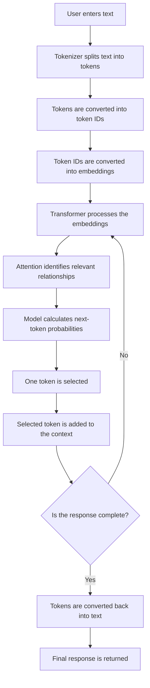

# Large Language Models (LLMs)

## 1. What Is a Large Language Model?

A **Large Language Model (LLM)** is a type of artificial intelligence trained on enormous amounts of text.

During training, an LLM learns patterns in language, such as:

- How words and sentences are structured
- How ideas are connected
- How questions are commonly answered
- How different writing styles work
- Which words or tokens are likely to appear together

After learning these patterns, an LLM can understand an input and generate a relevant response.

### Examples of Well-Known LLMs

- GPT
- Claude
- Gemini
- Llama
- Mistral

---

## 2. The Main Idea Behind an LLM

At its core, an LLM performs a simple task:

> It predicts the next token based on the tokens that came before it.

For example, consider the following sentence:

```text
The sky is ___
```

The model might predict:

```text
blue
```

It predicts **blue** because it learned during training that this word commonly appears after **“The sky is.”**

For a longer response, the model repeats this prediction process:

```text
Input: The sky is
Prediction 1: blue

Updated text: The sky is blue
Prediction 2: during

Updated text: The sky is blue during
Prediction 3: the
```

This process continues until the model completes the response or reaches a specified limit.

Although next-token prediction sounds simple, learning from enormous amounts of text allows an LLM to perform many tasks, including:

- Answering questions
- Explaining concepts
- Writing and reviewing code
- Summarizing documents
- Translating languages
- Generating stories and articles
- Classifying information
- Extracting information

---

## 3. LLMs Do Not Simply Copy from a Database

An LLM does not usually search a database for an existing sentence and copy it directly.

Instead, it learns:

- Language patterns
- Relationships between concepts
- Common sentence structures
- Statistical connections between tokens

It then uses these learned patterns to generate a new response.

> [!NOTE]
> An LLM may occasionally reproduce parts of its training data, especially when the text is common or has appeared many times during training.

---

## 4. LLMs Process Tokens, Not Words

LLMs do not directly process text as complete words. They process smaller units called **tokens**.

A token can be:

- A complete word
- Part of a word
- A punctuation mark
- A number
- A space or special character

For example:

```text
Hello
```

Depending on the tokenizer, `Hello` might be represented as one token.

A longer word such as:

```text
unbelievable
```

might be divided into multiple tokens:

```text
un + believable
```

The exact division depends on the tokenizer used by the model.

### Tokenization Flow

```text
Raw text
    ↓
Tokenizer
    ↓
Tokens
    ↓
Token IDs (numbers)
```

For example:

```text
"I love programming"
          ↓
["I", " love", " programming"]
          ↓
[40, 3021, 15840]
```

> [!NOTE]
> The token IDs shown above are only examples. Different models can use different tokenizers and assign different IDs.

---

## 5. What Is a Tokenizer?

A **tokenizer** is a component that converts text into tokens and maps those tokens to numerical IDs.

Neural networks work with numbers, not raw text. Therefore, tokenization must happen before the model can process a sentence.

For example:

```text
Input text:
"Go is fast"

Tokenized form:
["Go", " is", " fast"]

Token IDs:
[1234, 318, 5421]
```

The model processes these token IDs internally.

After generating output token IDs, the tokenizer converts them back into readable text.

```text
Input text
    ↓
Input tokens
    ↓
Token IDs
    ↓
LLM processing
    ↓
Output token IDs
    ↓
Output tokens
    ↓
Readable response
```

---

## 6. What Are Embeddings?

Token IDs are only identifiers. By themselves, they do not contain useful information about a token's meaning.

Therefore, the model converts every token into a richer numerical representation called an **embedding**.

An embedding is a list of numbers that represents the learned properties of a token.

Conceptually:

```text
Token: "king"

Token ID:
4521

Embedding:
[0.12, -0.48, 0.73, ...]
```

Embeddings help the model represent relationships between words and concepts.

For example, the model may learn that the following words are related:

```text
dog    → animal, pet, puppy
car    → vehicle, road, driving
doctor → hospital, patient, medicine
```

Embeddings do not directly store dictionary definitions. Instead, they represent learned relationships in a mathematical space.

---

## 7. Transformers

Most modern LLMs are based on a neural-network architecture called the **Transformer**.

Transformers are effective at processing language because they can examine relationships between tokens in the input.

For example:

```text
The animal did not cross the road because it was tired.
```

To understand the word **“it,”** the model must determine what **“it”** refers to.

In this example:

```text
"it" → "the animal"
```

The Transformer helps the model connect **“it”** with **“the animal,”** even though other words appear between them.

Transformers can identify relationships between tokens even when the tokens are far apart in a sentence or document.

---

## 8. Attention

Transformers use a mechanism called **attention**.

Attention helps the model determine which tokens are most relevant to one another while processing the input.

Consider the following sentence:

```text
Charan put the laptop inside the bag because it was expensive.
```

To understand what **“it”** refers to, the model should pay more attention to **“laptop”** than to **“bag.”**

Conceptually:

```text
"it" → laptop: higher attention
"it" → bag: lower attention
```

> [!IMPORTANT]
> Attention does not mean that the model is conscious or thinking like a human. It is a mathematical mechanism used to calculate relationships between tokens.

### Self-Attention

When the model calculates relationships between tokens within the same input, it is called **self-attention**.

Self-attention helps the model understand:

- Context
- Grammar
- Relationships between words
- References such as `he`, `she`, `they`, and `it`
- Dependencies between distant parts of a sentence

---

## 9. Context

The text available to the model while generating a response is called its **context**.

Context may include:

- The user's current message
- Previous messages in the conversation
- System instructions
- Documents provided to the model
- Tokens the model has already generated

For example:

```text
Charan is learning Go.
He wants to become a backend engineer.

Question:
What programming language is Charan learning?
```

The model uses the earlier sentence as context to answer:

```text
Charan is learning Go.
```

### Context Window

The amount of text a model can consider at one time is called its **context window**.

A larger context window allows the model to process more information at once, such as:

- Longer conversations
- Larger documents
- More source code
- More detailed instructions

However, having a large context window does not guarantee that the model will use every piece of information perfectly.

---

## 10. Autoregressive Text Generation

LLMs usually generate text **autoregressively**.

Autoregressive generation means:

> The model generates one token at a time, and every new token is predicted using the context available so far.

For example:

```text
Initial input:
Go is a

Step 1:
Go is a programming

Step 2:
Go is a programming language

Step 3:
Go is a programming language designed

Step 4:
Go is a programming language designed for
```

The model does not normally generate the entire response in a single step.

Instead, it repeatedly:

1. Predicts the next token
2. Adds that token to the context
3. Uses the updated context
4. Predicts another token

This continues until the response is complete.

---

## 11. Simplified Internal Flow of an LLM

```text
User input
    ↓
Tokenizer
    ↓
Tokens
    ↓
Token IDs
    ↓
Embeddings
    ↓
Transformer layers
    ├── Self-attention
    ├── Context processing
    └── Pattern processing
    ↓
Probabilities for possible next tokens
    ↓
Select one token
    ↓
Add the selected token to the context
    ↓
Repeat the process
    ↓
Convert output tokens back into text
    ↓
Final response
```

### Example

Suppose the user enters:

```text
The capital of India is
```

The model performs approximately the following steps:

1. The tokenizer divides the sentence into tokens.
2. The tokens are converted into token IDs.
3. The token IDs are converted into embeddings.
4. Transformer layers process the relationships between the tokens.
5. The model calculates probabilities for possible next tokens.

A simplified probability distribution might look like this:

| Possible next token | Probability |
|---------------------|-------------|
| New                 | 70%         |
| Delhi               | 17%         |
| Mumbai              | 5%          |
| located             | 3%          |
| Other tokens        | 5%          |

The model might first select `New`.

The updated context becomes:

```text
The capital of India is New
```

The model then predicts the next token:

| Possible next token | Probability |
|---------------------|-------------|
| Delhi               | 95%         |
| York                | 2%          |
| Other tokens        | 3%          |

The final answer becomes:

```text
The capital of India is New Delhi.
```

> [!NOTE]
> The probabilities shown above are simplified examples. The actual calculations performed by an LLM are much more complex.

---

## 12. Training and Generation Are Different

An LLM has two major stages:

1. Training
2. Inference

### 12.1 Training

During training, the model processes enormous amounts of text and learns by trying to predict missing or next tokens.

Consider the following training example:

```text
Training text:
"Go is a programming language."

Input:
"Go is a programming"

Expected next token:
"language"

Model prediction:
"framework"
```

Because the prediction is incorrect, the model:

1. Calculates the prediction error.
2. Adjusts its internal parameters.
3. Tries to make a better prediction next time.

This process is repeated billions or trillions of times using a huge amount of text.

### 12.2 Inference

**Inference** is the stage in which a trained model receives an input and generates a response.

```text
Training  → The model learns patterns
Inference → The model uses the learned patterns
```

The model generally does not update its core knowledge during a normal conversation.

It uses:

- Knowledge learned during training
- Instructions included in the current request
- Information available in the current context

---

## 13. Why Can LLMs Give Incorrect Answers?

An LLM generates responses by predicting likely tokens. It does not automatically verify every statement against reality.

Because of this, it may produce information that sounds convincing but is incorrect.

This is commonly called a **hallucination**.

Hallucinations can happen when:

- The model does not have enough relevant information
- The user's prompt is unclear
- The required information is outdated
- The model mixes similar facts together
- The model predicts a fluent answer instead of a factually correct answer

> [!WARNING]
> Important medical, legal, financial, security-related, or current information should always be verified using reliable sources.

---

## 14. Does an LLM Understand Like a Human?

An LLM can produce responses that appear intelligent, but it does not necessarily understand the world in the same way humans do.

An LLM:

- Does not have human consciousness
- Does not have personal experiences
- Does not have emotions
- Does not automatically know whether its response is true
- Predicts text using learned numerical patterns

However, because it has learned complex relationships from enormous amounts of text, it can perform many tasks that appear to require understanding.

---

## 15. Complete LLM Flow



---

## 16. Important Terms

| Term | Meaning |
|------|---------|
| **LLM** | A neural network trained on enormous amounts of text |
| **Token** | A small unit of text processed by the model |
| **Tokenizer** | Converts text into tokens and token IDs |
| **Token ID** | A number used to identify a token |
| **Embedding** | A numerical representation containing learned information about a token |
| **Transformer** | The neural-network architecture used by most modern LLMs |
| **Attention** | A mechanism for identifying relationships between tokens |
| **Context** | The information available to the model while generating a response |
| **Context window** | The maximum amount of information the model can process at once |
| **Autoregressive generation** | Generating one token at a time using previous tokens |
| **Training** | The process in which the model learns language patterns |
| **Inference** | Using a trained model to generate a response |
| **Hallucination** | A confident-sounding but incorrect or unsupported response |

---

## 17. Important Points to Remember

- An LLM is a neural network trained on enormous amounts of text.
- It learns patterns and relationships in language.
- It predicts the next token based on the available context.
- It processes tokens instead of directly processing complete words.
- A tokenizer converts text into token IDs.
- Embeddings provide richer numerical representations of tokens.
- Most modern LLMs use the Transformer architecture.
- Transformers use attention to identify relationships between tokens.
- LLMs usually generate responses one token at a time.
- Training is where the model learns patterns.
- Inference is where the trained model generates responses.
- An LLM does not think or understand exactly like a human.
- An LLM can generate confident but incorrect information.

---

## One-Line Summary

> A Large Language Model is a Transformer-based neural network that learns language patterns from enormous amounts of text and generates responses by repeatedly predicting the next token using the available context.
