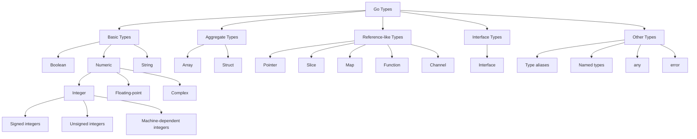
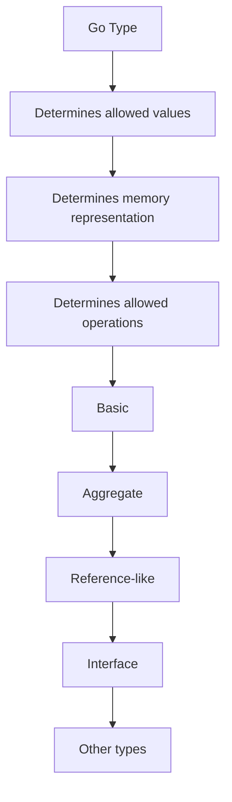

# Go Types

- Go types are the important foundation to understand because they affect how we design structs, APIs, databases, interfaces, concurrency code.
 - A ***"type"*** tells Go what kind of value a variable can hold and what kind of operations can be performed on it.
	- Eg :- 
		- var age int = 25
		- var name string = "charan"
		- var active bool = false
- Go is statistically typed language => type of a variable is know at the compile time

A **type** in Go defines:

- What values are allowed
- How much memory is required
- What operations are allowed

## Go Type Classification



---
=
# 1. Basic Types

Basic types represent the fundamental values available in Go.

## 1.1 Boolean

A Boolean value represents either `true` or `false`.

```go
var isActive bool = true
var isCompleted bool = false
```

The zero value of `bool` is:

```go
false
```

---

## 1.2 Numeric Types

Numeric types are divided into:

- Integer types
- Floating-point types
- Complex-number types

### Integer Types

Integer types store whole numbers without a decimal point.

#### Signed integers

Signed integers can store both negative and positive values.

| Type | Size | Approximate range |
|---|---:|---|
| `int8` | 8 bits | -128 to 127 |
| `int16` | 16 bits | -32,768 to 32,767 |
| `int32` | 32 bits | -2³¹ to 2³¹ − 1 |
| `int64` | 64 bits | -2⁶³ to 2⁶³ − 1 |
| `int` | 32 or 64 bits | Depends on the platform |

```go
var age int = 25
var temperature int8 = -10
var population int64 = 8_000_000_000
```

#### Unsigned integers

Unsigned integers store only zero and positive values.

| Type | Size | Approximate range |
|---|---:|---|
| `uint8` | 8 bits | 0 to 255 |
| `uint16` | 16 bits | 0 to 65,535 |
| `uint32` | 32 bits | 0 to 2³² − 1 |
| `uint64` | 64 bits | 0 to 2⁶⁴ − 1 |
| `uint` | 32 or 64 bits | Depends on the platform |
| `uintptr` | 32 or 64 bits | Stores pointer-sized integers |

```go
var count uint = 100
var port uint16 = 8080
```

### Integer aliases

Go provides the following predefined aliases:

```go
byte = uint8
rune = int32
```

- `byte` is commonly used for raw binary data or UTF-8 bytes.
- `rune` is commonly used to represent a Unicode code point.

```go
var character rune = 'A'
var data byte = 255
```

---

### Floating-Point Types

Floating-point types store numbers containing decimal values.

| Type | Size | Precision |
|---|---:|---|
| `float32` | 32 bits | Approximately 6–7 decimal digits |
| `float64` | 64 bits | Approximately 15–16 decimal digits |

```go
var price float64 = 199.99
var percentage float32 = 82.5
```

Go uses `float64` by default for floating-point literals.

---

### Complex Types

Complex types represent numbers containing real and imaginary parts.

| Type | Components |
|---|---|
| `complex64` | Two `float32` values |
| `complex128` | Two `float64` values |

```go
var number complex128 = complex(3, 4)

fmt.Println(real(number)) // 3
fmt.Println(imag(number)) // 4
```

---

## 1.3 String

A string is an immutable sequence of bytes, usually containing UTF-8 encoded text.

```go
var name string = "Charan"
message := "Learning Go"
```

Important properties:

- Strings are immutable.
- A string may contain multiple Unicode characters.
- `len()` returns the number of bytes, not necessarily the number of characters.
- Backticks can be used to create raw string literals.

```go
normal := "Hello\nGo"

raw := `Hello
Go`
```

Example with Unicode:

```go
text := "Hello, 世界"

fmt.Println(len(text))         // Number of bytes
fmt.Println(len([]rune(text))) // Number of Unicode characters
```

---

# 2. Aggregate Types

Aggregate types combine multiple values into a single value.

## 2.1 Array

An array stores a fixed number of elements of the same type.

```go
var numbers [3]int = [3]int{10, 20, 30}
```

Shorter form:

```go
numbers := [3]int{10, 20, 30}
```

Let Go calculate the array length:

```go
numbers := [...]int{10, 20, 30}
```

Important properties:

- The size of an array is fixed.
- The array length is part of its type.
- Arrays are copied when assigned or passed to functions.

```go
first := [3]int{1, 2, 3}
second := first

second[0] = 100

fmt.Println(first)  // [1 2 3]
fmt.Println(second) // [100 2 3]
```

---

## 2.2 Struct

A struct groups related fields, which may have different types.

```go
type User struct {
    ID       int
    Name     string
    IsActive bool
}
```

Creating a struct value:

```go
user := User{
    ID:       1,
    Name:     "Charan",
    IsActive: true,
}
```

Accessing a field:

```go
fmt.Println(user.Name)
```
Structs are heavily used for 
	- Database models
	- DTO's
	- request objects
	- response objects
	- configurations
	- domain models

Structs are value types . Let's understand with an example
```
let 
	user1 := User {
		Name : "Charan"
	}
Now
	user2 := user1
Now if we change the value of the varibale user2
	user2.Name = "Aparna"
it won't change the value of the user1
```

---

# 3. Reference-like Types

These types contain descriptors, pointers or runtime-managed references to underlying data.

> Go is always pass-by-value. However, copying some values—such as slices, maps, channels and pointers—allows multiple variables to access the same underlying data.

## 3.1 Pointer

A pointer stores the memory address of another value.

```go
number := 10
pointer := &number

fmt.Println(pointer)  // Address
fmt.Println(*pointer) // 10
```

Updating a value through a pointer:

```go
*pointer = 20

fmt.Println(number) // 20
```

Pointers are heavily used with the structs and method receivers.

The zero value of a pointer is `nil`.

---

## 3.2 Slice

A slice is a flexible view over an underlying array.

```go
numbers := []int{10, 20, 30}
```

A slice internally contains:

- A pointer to an underlying array
- A length
- A capacity

```go
fmt.Println(len(numbers))
fmt.Println(cap(numbers))
```

Adding elements:

```go
numbers = append(numbers, 40)
```

Creating a slice using `make`:

```go
values := make([]int, 3, 5)
```

Here:

- Length is `3`
- Capacity is `5`

The zero value of a slice is `nil`.

---

## 3.3 Map

A map stores values as key-value pairs.

```go
users := map[int]string{
    1: "Charan",
    2: "Rahul",
}
```

Reading a value:

```go
name := users[1]
```

Checking whether a key exists:

```go
name, exists := users[1]

if exists {
    fmt.Println(name)
}
```

Adding or updating a value:

```go
users[3] = "Anil"
```

Deleting a value:

```go
delete(users, 2)
```

Creating a map using `make`:

```go
users := make(map[int]string)
```

A nil map can be read, but inserting values into it causes a runtime panic.

---

## 3.4 Function

Functions are also values in Go. They can be assigned to variables, passed as arguments and returned from other functions.

```go
var add func(int, int) int

add = func(a int, b int) int {
    return a + b
}

fmt.Println(add(10, 20))
```

A named function type can also be created:

```go
type Operation func(int, int) int
```

The zero value of a function is `nil`.

- This enables 
	- callbacks
	- middleware
	- dependency injection
	- higher order fuctions

---

## 3.5 Channel

A channel allows goroutines to communicate safely.

```go
messages := make(chan string)
```

Sending a value:

```go
messages <- "Hello"
```

Receiving a value:

```go
message := <-messages
```

Example with a goroutine:

```go
messages := make(chan string)

go func() {
    messages <- "Hello from goroutine"
}()

message := <-messages
fmt.Println(message)
```

The zero value of a channel is `nil`.

---

# 4. Interface Types

An interface defines behavior using a collection of method signatures.

```go
type Speaker interface {
    Speak() string
}
```

A type implements an interface automatically by implementing its methods.

```go
type Person struct {
    Name string
}

func (p Person) Speak() string {
    return "Hello, I am " + p.Name
}
```

Using the interface:

```go
func Introduce(s Speaker) {
    fmt.Println(s.Speak())
}

func main() {
    person := Person{Name: "Charan"}
    Introduce(person)
}
```

Go does not require an explicit `implements` keyword.

---

# 5. Other Types

## 5.1 Named Types

A named type creates a new and distinct type based on an existing type.

```go
type UserID int
type Email string
```

Example:

```go
var id UserID = 100
var email Email = "charan@example.com"
```

Although `UserID` is based on `int`, it is treated as a separate type.

```go
var number int = 100
var id UserID = UserID(number)
```

Named types improve:

- Type safety
- Code readability
- Domain modelling
- Method organization

Methods can be attached to named types:

```go
type Celsius float64

func (c Celsius) ToFahrenheit() float64 {
    return float64(c)*9/5 + 32
}
```

---

## 5.2 Type Aliases

A type alias gives another name to an existing type.

```go
type UserIdentifier = int
```

`UserIdentifier` and `int` are exactly the same type.

```go
var id UserIdentifier = 100
var number int = id
```

Difference between a named type and an alias:

```go
type UserID int          // New named type
type UserIdentifier = int // Alias for int
```

---

## 5.3 `any`

`any` is an alias for `interface{}`.

```go
type any = interface{}
```

It can hold a value of any type:

```go
var value any

value = 100
value = "Hello"
value = true
```

A type assertion can retrieve the underlying value:

```go
text, ok := value.(string)

if ok {
    fmt.Println(text)
}
```

A type switch can handle multiple possible types:

```go
func printValue(value any) {
    switch current := value.(type) {
    case int:
        fmt.Println("Integer:", current)
    case string:
        fmt.Println("String:", current)
    case bool:
        fmt.Println("Boolean:", current)
    default:
        fmt.Println("Unknown type")
    }
}
```

---

## 5.4 `error`

`error` is a predefined interface used to represent errors.

Its definition is conceptually:

```go
type error interface {
    Error() string
}
```

Creating an error:

```go
import "errors"

err := errors.New("something went wrong")
```

Using formatted errors:

```go
import "fmt"

err := fmt.Errorf("user with ID %d was not found", 10)
```

Returning an error from a function:

```go
func divide(a float64, b float64) (float64, error) {
    if b == 0 {
        return 0, errors.New("cannot divide by zero")
    }

    return a / b, nil
}
```

Handling the returned error:

```go
result, err := divide(10, 0)

if err != nil {
    fmt.Println("Error:", err)
    return
}

fmt.Println(result)
```

---

# Summary



| Category | Types |
|---|---|
| Basic | `bool`, integers, floating-point numbers, complex numbers and `string` |
| Aggregate | Arrays and structs |
| Reference-like | Pointers, slices, maps, functions and channels |
| Interface | Interfaces that define behaviour |
| Other | Named types, type aliases, `any` and `error` |
