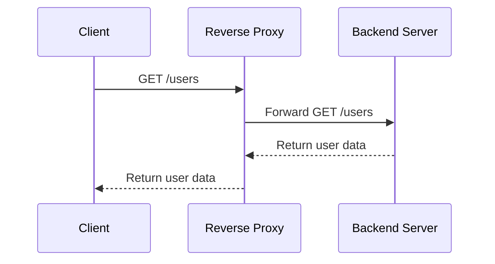
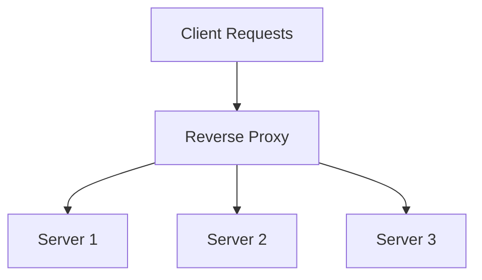
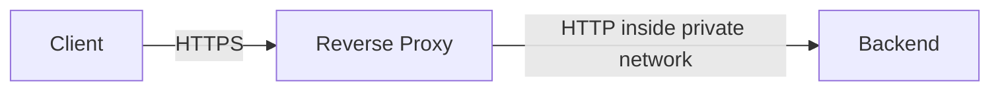
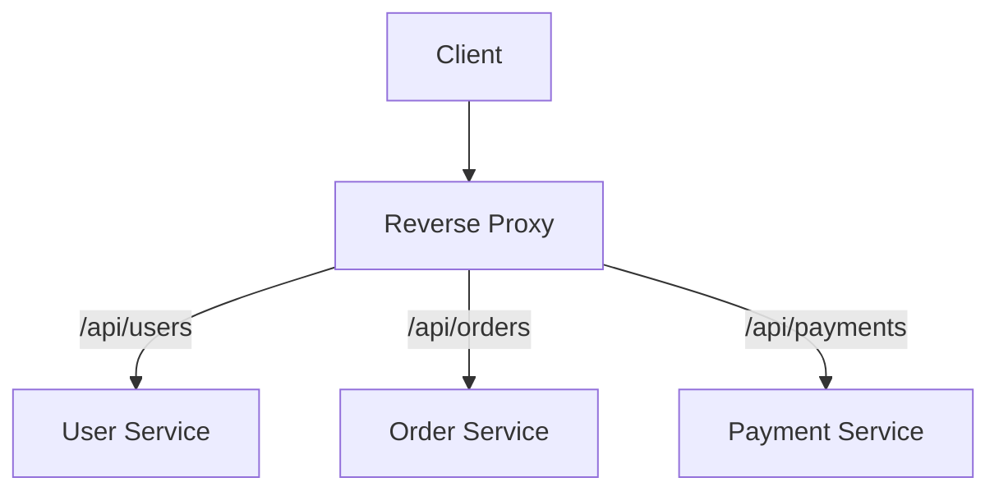
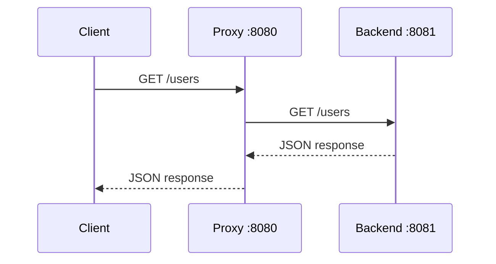

# Reverse Proxy in Go

## 1. What Is a Reverse Proxy?

A **reverse proxy is a server that stands between clients and backend servers**.

The client sends requests to the reverse proxy instead of communicating directly with the backend servers.

```text
Client → Reverse Proxy → Backend Server
Client ← Reverse Proxy ← Backend Server
```

For example, the client sends a request to:

```text
https://api.example.com
```

Internally, the reverse proxy may forward it to:

```text
http://users-service:8081
```

The client does not know the address of the actual backend server.

---

## 2. How Does a Reverse Proxy Work?



Suppose the client sends:

```http
GET /users
Host: api.example.com
```

The following happens:

1. The request reaches the reverse proxy.
2. The proxy selects a backend server.
3. It forwards the request to that server.
4. The backend processes the request.
5. The backend returns a response to the proxy.
6. The proxy returns that response to the client.

The client does not need to know which backend handled the request.

---

## 3. Why Do We Need a Reverse Proxy?

### 3.1 Load Balancing

The reverse proxy can distribute requests across multiple servers.



For example:

```text
Request 1 → Server 1
Request 2 → Server 2
Request 3 → Server 3
Request 4 → Server 1
```

This prevents one server from handling all the traffic.

---

### 3.2 Hiding Backend Servers

Clients only know the public address of the reverse proxy.

```text
Public address:
api.example.com

Private backend addresses:
10.0.1.10:8081
10.0.1.11:8081
10.0.1.12:8081
```

Because backend servers are not directly exposed, clients cannot communicate with them directly.

---

### 3.3 TLS Termination

The reverse proxy can handle HTTPS communication for all backend services.



The reverse proxy:

1. Receives the encrypted HTTPS request.
2. Decrypts it using the TLS certificate.
3. Forwards it to the backend.
4. Encrypts the response before returning it to the client.

This allows TLS certificates to be managed in one place.

---

### 3.4 Path-Based Routing

The reverse proxy can route requests to different services based on the URL path.

```text
/api/users/*    → User Service
/api/orders/*   → Order Service
/api/payments/* → Payment Service
```

For example:

```text
GET /api/users/10
```

may be sent to the user service, while:

```text
GET /api/orders/25
```

may be sent to the order service.



---

### 3.5 Centralized Features

A reverse proxy can provide common functionality such as:

- Authentication
- Rate limiting
- Request logging
- Response compression
- Caching
- Security headers
- Metrics
- Distributed tracing

However, application business logic should normally remain inside backend services.

---

## 4. Reverse Proxy vs Forward Proxy

The main difference is **whose identity is hidden**.

| Proxy type | Works on behalf of | Usually hides |
|---|---|---|
| Forward proxy | Client | Client from the internet |
| Reverse proxy | Server | Backend servers from clients |

### Forward Proxy

```text
Employee → Company Proxy → Internet
```

The website sees the company proxy instead of directly seeing the employee's computer.

### Reverse Proxy

```text
Internet User → Reverse Proxy → Company Servers
```

The user sees the reverse proxy instead of the internal company servers.

A useful way to remember this is:

> A forward proxy represents clients.  
> A reverse proxy represents servers.

---

# 5. Building a Basic Reverse Proxy in Go

Go provides the `net/http/httputil` package for creating HTTP reverse proxies.

```go
package main

import (
	"log"
	"net/http"
	"net/http/httputil"
	"net/url"
)

func main() {
	backendURL, err := url.Parse("http://localhost:8081")
	if err != nil {
		log.Fatal(err)
	}

	proxy := httputil.NewSingleHostReverseProxy(backendURL)

	proxy.ErrorHandler = func(
		writer http.ResponseWriter,
		request *http.Request,
		err error,
	) {
		log.Printf("proxy error: %v", err)

		http.Error(
			writer,
			"backend service unavailable",
			http.StatusBadGateway,
		)
	}

	log.Println("reverse proxy running on :8080")

	if err := http.ListenAndServe(":8080", proxy); err != nil {
		log.Fatal(err)
	}
}
```

---

## 6. Step-by-Step Code Explanation

### Step 1: Parse the Backend Address

```go
backendURL, err := url.Parse("http://localhost:8081")
```

This tells the reverse proxy where the backend server is running.

```text
Reverse proxy: localhost:8080
Backend:       localhost:8081
```

`url.Parse()` converts the backend address into a `url.URL` value that Go's reverse proxy can use.

If the URL is invalid, the program stops:

```go
if err != nil {
	log.Fatal(err)
}
```

---

### Step 2: Create the Reverse Proxy

```go
proxy := httputil.NewSingleHostReverseProxy(backendURL)
```

This creates an HTTP handler that:

1. Receives a client request.
2. Changes the destination to `localhost:8081`.
3. Sends the request to the backend.
4. Reads the backend response.
5. Returns the response to the client.

It forwards information such as:

- HTTP method
- URL path
- Query parameters
- HTTP headers
- Request body

For example, if the proxy receives:

```http
POST /users?send_email=true
```

it forwards the request to:

```text
http://localhost:8081/users?send_email=true
```

---

### Step 3: Handle Backend Failures

```go
proxy.ErrorHandler = func(
	writer http.ResponseWriter,
	request *http.Request,
	err error,
) {
	log.Printf("proxy error: %v", err)

	http.Error(
		writer,
		"backend service unavailable",
		http.StatusBadGateway,
	)
}
```

The backend might be:

- Stopped
- Overloaded
- Unreachable
- Taking too long to respond

When the proxy cannot communicate with the backend, it returns:

```http
HTTP/1.1 502 Bad Gateway
```

A `502 Bad Gateway` generally means:

> The reverse proxy received the request but could not get a valid response from the backend server.

---

### Step 4: Start the Reverse Proxy

```go
http.ListenAndServe(":8080", proxy)
```

This starts an HTTP server on port `8080`.

The `proxy` object handles every incoming request.



---

# 7. Backend Server for Testing

Create another Go program for the backend server:

```go
package main

import (
	"encoding/json"
	"log"
	"net/http"
)

func main() {
	http.HandleFunc("/users", func(
		writer http.ResponseWriter,
		request *http.Request,
	) {
		response := map[string]any{
			"server": "server-1",
			"users":  []string{"Charan", "Anu"},
		}

		writer.Header().Set(
			"Content-Type",
			"application/json",
		)

		if err := json.NewEncoder(writer).Encode(response); err != nil {
			log.Printf("failed to encode response: %v", err)
		}
	})

	log.Println("backend running on :8081")

	if err := http.ListenAndServe(":8081", nil); err != nil {
		log.Fatal(err)
	}
}
```

The backend listens on port `8081` and exposes:

```http
GET /users
```

It returns:

```json
{
  "server": "server-1",
  "users": ["Charan", "Anu"]
}
```

---

## 8. Testing the Reverse Proxy

First, start the backend server:

```bash
go run backend.go
```

Next, start the reverse proxy:

```bash
go run proxy.go
```

Call the proxy using:

```bash
curl http://localhost:8080/users
```

You should receive:

```json
{
  "server": "server-1",
  "users": ["Charan", "Anu"]
}
```

You contacted port `8080`, but the response was generated by the backend running on port `8081`.

```text
curl
  ↓
localhost:8080
  ↓
Reverse proxy
  ↓
localhost:8081
  ↓
Backend server
```

---

# 9. Important Proxy Headers

The backend may need information about the original client request.

Common proxy headers include:

```http
X-Forwarded-For: 203.0.113.10
X-Forwarded-Host: api.example.com
X-Forwarded-Proto: https
```

| Header | Meaning |
|---|---|
| `X-Forwarded-For` | Original client IP address |
| `X-Forwarded-Host` | Original host requested by the client |
| `X-Forwarded-Proto` | Original protocol, such as HTTP or HTTPS |

Without these headers, the backend may believe every request came directly from the reverse proxy.

## Security Warning

Forwarded headers should only be trusted when requests come from a trusted reverse proxy.

A public client could send a fake header:

```http
X-Forwarded-For: 10.0.0.1
```

Therefore, the backend should not blindly trust forwarded headers from every incoming connection.

---

# 10. Reverse Proxy With Multiple Backends

A reverse proxy becomes a basic load balancer when it distributes requests across multiple backend servers.

```go
package main

import (
	"log"
	"net/http"
	"net/http/httputil"
	"net/url"
	"sync/atomic"
)

var backendAddresses = []string{
	"http://localhost:8081",
	"http://localhost:8082",
	"http://localhost:8083",
}

var requestCounter uint64

func nextBackend() *url.URL {
	current := atomic.AddUint64(&requestCounter, 1)

	index := (current - 1) % uint64(len(backendAddresses))

	backend, err := url.Parse(backendAddresses[index])
	if err != nil {
		panic(err)
	}

	return backend
}

func proxyHandler(
	writer http.ResponseWriter,
	request *http.Request,
) {
	backend := nextBackend()

	proxy := httputil.NewSingleHostReverseProxy(backend)

	log.Printf(
		"forwarding %s %s to %s",
		request.Method,
		request.URL.Path,
		backend,
	)

	proxy.ErrorHandler = func(
		writer http.ResponseWriter,
		request *http.Request,
		err error,
	) {
		log.Printf("backend %s failed: %v", backend, err)

		http.Error(
			writer,
			"backend service unavailable",
			http.StatusBadGateway,
		)
	}

	proxy.ServeHTTP(writer, request)
}

func main() {
	server := &http.Server{
		Addr:    ":8080",
		Handler: http.HandlerFunc(proxyHandler),
	}

	log.Println("reverse proxy running on :8080")
	log.Fatal(server.ListenAndServe())
}
```

---

## 11. How Backend Selection Works

### Store the Backend Addresses

```go
var backendAddresses = []string{
	"http://localhost:8081",
	"http://localhost:8082",
	"http://localhost:8083",
}
```

These are the servers between which requests will be distributed.

---

### Increment the Request Counter

```go
current := atomic.AddUint64(&requestCounter, 1)
```

This increases the request counter safely.

The `atomic` package is used because multiple requests may arrive concurrently.

Without safe synchronization, multiple goroutines could read or update the counter at the same time.

---

### Calculate the Backend Index

```go
index := (current - 1) % uint64(len(backendAddresses))
```

The modulo operation keeps the index inside the backend list.

For three backend servers:

```text
Request counter: 1  2  3  4  5  6
Backend index:   0  1  2  0  1  2
```

Therefore:

```text
Request 1 → Server 1
Request 2 → Server 2
Request 3 → Server 3
Request 4 → Server 1
```

This strategy is called **round-robin load balancing**.

---

### Select the Backend

```go
backend := nextBackend()
```

This returns the backend that should handle the current request.

---

### Forward the Request

```go
proxy.ServeHTTP(writer, request)
```

`ServeHTTP()` forwards the request to the selected backend and writes the backend response to the client.

---

# 12. What If a Backend Is Unhealthy?

Basic round-robin selection does not know whether a server is working.

Imagine:

```text
Server 1 → Healthy
Server 2 → Down
Server 3 → Healthy
```

If the reverse proxy selects Server 2, the request fails.

A production proxy normally performs health checks.

For example:

```http
GET http://server-2:8082/health
```

A healthy server might return:

```http
HTTP/1.1 200 OK
```

If a server repeatedly fails its health check, the proxy temporarily removes it from request selection.

```text
Server 1 → Healthy → Receives requests
Server 2 → Down    → Excluded
Server 3 → Healthy → Receives requests
```

There are two common health-check strategies.

### Active Health Check

The proxy periodically sends requests to an endpoint such as:

```http
GET /health
```

### Passive Health Check

The proxy observes failures from real client requests.

For example:

- Connection refused
- Request timeout
- Invalid backend response
- Repeated `500` errors

Production systems often use both active and passive health checks.

---

# 13. Timeouts Are Essential

Without timeouts, a slow client or backend could make the proxy wait indefinitely.

```go
server := &http.Server{
	Addr:              ":8080",
	Handler:           http.HandlerFunc(proxyHandler),
	ReadHeaderTimeout: 5 * time.Second,
	ReadTimeout:       10 * time.Second,
	WriteTimeout:      15 * time.Second,
	IdleTimeout:       60 * time.Second,
}
```

These timeouts protect the proxy from:

- Slow clients
- Hanging backend servers
- Connections remaining open forever
- Resource exhaustion

The proxy's HTTP transport should also contain connection and response timeouts.

```go
transport := &http.Transport{
	DialContext: (&net.Dialer{
		Timeout: 5 * time.Second,
	}).DialContext,

	ResponseHeaderTimeout: 10 * time.Second,
	IdleConnTimeout:       60 * time.Second,
	MaxIdleConns:          100,
	MaxIdleConnsPerHost:   20,
}
```

The transport can then be assigned to the reverse proxy:

```go
proxy.Transport = transport
```

---

# 14. Common HTTP Status Codes

| Status code | Meaning |
|---|---|
| `200 OK` | Backend successfully processed the request |
| `401 Unauthorized` | Authentication failed |
| `429 Too Many Requests` | Rate limit was exceeded |
| `502 Bad Gateway` | Proxy could not get a valid backend response |
| `503 Service Unavailable` | No healthy backend is available |
| `504 Gateway Timeout` | Backend took too long to respond |

The difference between `502` and `504` is important:

```text
502 → The backend connection or response was invalid.
504 → The backend did not respond within the allowed time.
```

---

# 15. Reverse Proxy vs Load Balancer vs API Gateway

These components have overlapping features, but their primary responsibilities differ.

| Component | Primary responsibility |
|---|---|
| Reverse proxy | Receive and forward requests |
| Load balancer | Distribute requests across servers |
| API gateway | Apply API-level routing and policies |

An API gateway commonly provides:

- Authentication
- Authorization
- Rate limiting
- API keys
- Request transformation
- Usage quotas
- API analytics

A single tool can perform multiple roles.

For example, NGINX can work as:

- A reverse proxy
- A load balancer
- A TLS terminator
- A cache
- An API gateway component

---

# 16. Retries and Their Risks

A proxy may retry a request when one backend fails.

For example:

```text
Client
  ↓
Proxy
  ↓
Server 1 fails
  ↓
Proxy retries
  ↓
Server 2 succeeds
```

Retries are usually safer for read operations such as:

```http
GET /users/10
```

Retries require special care for write operations such as:

```http
POST /payments
```

The first request might succeed, but its response could be lost. Retrying it might create the payment twice.

For important write operations, APIs commonly use an idempotency key:

```http
Idempotency-Key: payment-12345
```

The backend uses this key to recognize duplicate requests.

---

# 17. Production Considerations

A production-ready reverse proxy should consider:

- Backend health checks
- Connection timeouts
- Request timeouts
- Graceful shutdown
- Structured logging
- Metrics
- Distributed tracing
- Rate limiting
- TLS certificate management
- Maximum request-body limits
- Retry policies
- Circuit breakers
- WebSocket support
- Streaming support
- Trusted forwarded-header configuration
- Backend connection pooling

---

# 18. Popular Reverse Proxy Tools

Common reverse proxy technologies include:

- NGINX
- HAProxy
- Envoy
- Traefik
- Caddy
- AWS Application Load Balancer
- Kubernetes Ingress Controllers
- Cloudflare

The Go `httputil.ReverseProxy` package is useful when:

- Learning how proxies work
- Building a custom internal proxy
- Creating a load balancer project
- Implementing application-specific routing
- Adding custom request-processing behavior

For general production traffic management, an established proxy such as NGINX, Envoy, HAProxy, or a cloud load balancer is often preferred.

---

# 19. Final Mental Model

Think of a reverse proxy as a **receptionist for backend servers**.

1. Clients communicate with the receptionist.
2. The receptionist receives the request.
3. The receptionist chooses an internal team.
4. The internal team's location remains private.
5. The internal team processes the request.
6. The response returns through the receptionist.

In technical terms:

```text
Receive → Inspect → Select → Forward → Return
```

That is the core behavior of a reverse proxy.